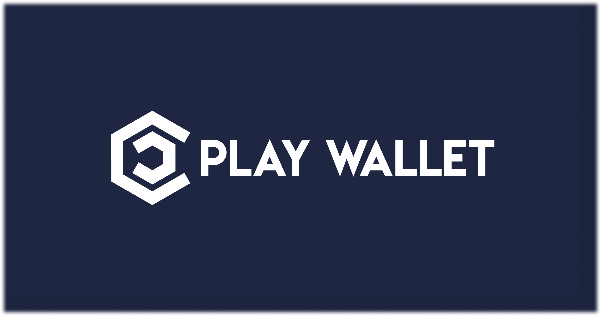

# نظرة عامة

<figure><figcaption></figcaption></figure>

### مقدمة

Play Wallet هو بروتوكول متكامل تمامًا على السلسلة مصمم لتمكينك من التنقل في سوق العملات المشفرة وفقًا لتفضيلاتك. من خلال المشاركة، تحصل على وصول حصري إلى نادي استثماري نخبوي يوفر دخلاً سلبيًا مستمرًا من خلال ميزات Play Wallet المبتكرة.

العديد من الأشخاص المهتمين بالعملات المشفرة غالبًا ما يجدون أنفسهم في حيرة عند البدء، نظرًا لتعدد الآليات المتاحة، مثل مجموعات NFT واللعب للربح والتحصيل و**نماذج الذكاء الاصطناعي**، والمزيد. مهمتنا هي تبسيط عملية الدخول للمبتدئين مع ضمان التعاون المربح على المدى الطويل للمستثمرين ذوي الخبرة من خلال إنشاء منصة موحدة وعامة.

المفتاح للاستثمار في منصتنا هو رمز NFT، حيث تحدد الكمية المحدودة للتوريد حدًا حصريًا لعدد المشاركين. يتم استخدام عائدات بيع رموز NFT لتوليد الأرباح من خلال عقد ذكي عام، مما يضمن الأتمتة الكاملة والشفافية. ميزة رئيسية لمنصتنا هي توزيع جميع الإيرادات على حاملي NFT، مما يعزز إحساس بالرخاء المشترك.


تركز Play Wallet على الاستدامة والنمو. خطتنا هي الإطلاق على جميع شبكات L2 الشهيرة، بما في ذلك Arbitrum(أول شبكة إطلاق)، zkSync، Polygon، Optimism، Fantom، Ton وغيرها. سيتمتع المتبنون المبكرون في الشبكة الأولى بنسبة من الأرباح من الشبكات اللاحقة، مما يعطيهم طعم الأموال الذكية ويكافئ التزامهم بنجاح Play Wallet.


### روعة Play Wallet

* سيتم استخدام جميع العائدات من بيع NFTs لتوليد الأرباح للمنصة، التي سيتم توزيعها بالكامل بين مشاركي Play Wallet.
* عملية توليد الأرباح شفافة تمامًا ويتم التحكم فيها بواسطة عقد ذكي، مما يضمن الثقة والمساءلة.
* تقدم Play Wallet مجموعة متنوعة من التفضيلات من خلال تقديم مجموعة متنوعة من آليات توليد الأرباح. قم بمزجها ومطابقتها لإنشاء استراتيجية مخصصة وجني مكافآت كبيرة.
* حيث يتطور المشروع، سيتم تشكيل اتجاهه المستقبلي حصريًا بواسطة Play Wallet DAO. تمتلك صوتك قيمة كبيرة للمجتمع ونجاح Play Wallet، مما يؤكد على أهمية المشاركة النشطة والتعاون.
* **رؤى التداول المدعومة بالذكاء الاصطناعي**: يوفر وضع [Marker Masters](play-to-earn/play-modes/market-masters/) رؤى تداول قيمة للأشخاص الذين يمتلكون الرموز $PLAYW باستخدام نموذج التداول الذكاء الاصطناعي لدينا. يتعلم هذا النموذج من مجموعة متنوعة من بيانات السوق، منشورات المؤثرين في العملات المشفرة على Twitter، نشاطات المحافظ الكبيرة، وتوقعات المستخدمين التي تم إجراؤها في وضع Marker Masters. مع تحسن النموذج، سيقدم رؤى أكثر دقة وربحية، مما يفيد جميع حاملي الرموز $PLAYW.

### اتجاهات المشروع في المستقبل

Play Wallet هو منصة متعددة الاستخدامات تهدف إلى أن تصبح الحل الأول لإدارة الأصول الرقمية والألعاب. بفريق من المطورين المهرة، تسعى Play Wallet لتغطية مجموعة واسعة من الأسواق وتقديم مجموعة شاملة من الميزات. في هذا الفصل، سنستكشف الاتجاهات المتنوعة للمشروع والإمكانيات التي يحملها للمستخدمين.

#### التعلم بالذكاء الاصطناعي

Play Wallet في طليعة الابتكار، تجمع بين قوة تقنية البلوكشين والتعدين والتعلم بالذكاء الاصطناعي. في هذا الفصل، سوف نستكشف مفهوم التعلم اللامركزي بالذكاء الاصطناعي ضمن نظام Play Wallet. من خلال استغلال موارد المستخدمين وإمكانيات الذكاء الاصطناعي، تحدث Play Wallet ثورة في طريقة تدريب ومكافأة نماذج الذكاء الاصطناعي.

* **التعلم اللامركزي:** تقدم Play Wallet منصة للتعلم اللامركزي حيث يمكن لأصحاب الذكاء الاصطناعي الاستفادة من قوة الحوسبة المشتركة للمشاركين في الشبكة لتدريب نماذجهم بكفاءة وتكلفة أقل. من خلال لامركزية عملية التعلم، تشجع المنصة على التعاون ومشاركة الموارد، مما يتيح لأصحاب الذكاء الاصطناعي الحصول على نتائج أسرع وأدق.
* **التكافؤ للحصول على اقتباسات التعلم:** للمشاركة في عملية التعلم بالذكاء الاصطناعي، يمكن للمستخدمين رهن أموالهم على المنصة. القدر الذي يتم فيه رهن الأموال يحدد الاقتباس الذي يحصلون عليه لاستخدام موارد التعلم بالذكاء الاصطناعي. هذا النهج المبتكر يسمح للمستخدمين بالمساهمة في نظام التعلم مع الحصول على مكافآت استنادًا إلى مساهمتهم.
* **تدريب الذكاء الاصطناعي بكفاءة تكلفة:** يمكن أن يكون التدريب التقليدي للذكاء الاصطناعي مكلفًا من حيث الموارد. ومع ذلك، مع نموذج التعلم اللامركزي لـ Play Wallet، يمكن لأصحاب الذكاء الاصطناعي تدريب نماذجهم بجزء من التكلفة. من خلال الوصول إلى قوة الحوسبة المشتركة والموارد التي يتم مشاركتها من قبل المجتمع، يمكن لأصحاب الذكاء الاصطناعي تقليل نفقاتهم بشكل كبير مع تحقيق نماذج ذكاء اصطناعي عالية الجودة.
* **حوافز لمشاركة الموارد:** يتم مكافأة المستخدمين الذين يسهمون بمواردهم الحوسبية لشبكة التعلم اللامركزي للمشاركة. من خلال مشاركة قوتهم الحوسبية، لا يدعم المستخدمون فقط عملية التعلم بالذكاء الاصطناعي ولكن أيض

اندماج تقنية البلوكتشين والتعدين وتعلم الذكاء الصناعي ضمن Play Wallet يفتح آفاقًا جديدة لتدريب الذكاء الصناعي الموزع. من خلال الجمع بين قوة الموارد الجماعية وتحفيز المشاركة، تمكن Play Wallet المستخدمين من المساهمة في عملية تعلم الذكاء الصناعي ومشاركة الجوائز. من خلال هذا النهج الابتكاري، تدفع Play Wallet بنمو تقنية الذكاء الصناعي وتسهيل اعتمادها على نطاق واسع في العديد من الصناعات.

#### ترميز العقارات

في هذا الفصل، نغمر في عالم مثير لترميز العقارات ضمن نظام Play Wallet. يمثل ترميز العقارات ابتكارًا رائدًا يحول الطريقة التي يتم بها امتلاك وتداول واستثمار العقارات. تهدف Play Wallet إلى فتح الإمكانيات الهائلة لترميز أصول العقارات، مما يجعلها أكثر وصولًا وسيولة وشمولًا للمستثمرين.

* **قوة الترميز:** يتضمن ترميز العقارات تحويل الأصول العقارية الفعلية إلى رموز رقمية يمكن تخزينها ونقلها بأمان على البلوكتشين. تتيح هذه العملية الملكية الجزئية، وتقسيم العقارات إلى وحدات أصغر يمكن شراءها وبيعها وتداولها بسهولة. من خلال ترميز العقارات، تجلب Play Wallet العديد من الفوائد لأصحاب العقارات والمستثمرين.
* **زيادة الوصول:** غالبًا ما تتطلب استثمارات العقارات التقليدية رأس مالًا كبيرًا، مما يقيد الوصول إلى عدد قليل مختار. من خلال ترميز العقارات، تديمقرطط ملكية العقار في Play Wallet، مما يتيح للمستثمرين من جميع الأحجام المشاركة. تجعل الملكية الجزئية من الممكن امتلاك جزء من العقار، مما يتيح للأفراد تنويع محافظهم الاستثمارية وكسب التعرض لسوق العقارات.
* **زيادة السيولة:** إحدى المزايا الرئيسية لترميز العقارات هي السيولة الم increased التي تجلبها للسوق. على عكس المعاملات العقارية التقليدية التي قد تكون مستهلكة للوقت ومعقدة، يمكن شراء وبيع العقارات المرمزة بسهولة على منصات البلوكتشين. توفر هذه السيولة للمستثمرين مرونة أكبر والقدرة على الخروج من استثماراتهم بكفاءة أكبر.
* **الشفافية والأمان:** من خلال استغلال تقنية البلوكتشين، تضمن Play Wallet الشفافية والأمان طوال عملية ترميز العقارات. يتم تسجيل سجلات ملكية العقارات وتاريخ المعاملات وتفاصيل الاستثمار بشكل ثابت على البلوكتشين، مما يقلل من الاحتيال ويزيد من الثقة بين المشاركين. تحكم العقود الذكية في نقل رموز العقار، مما يؤتمت ويبسط عملية المعاملة.
* **فوائد الملكية الجزئية:** تسمح الملكية الجزئية للمستثمرين بتنويع حيازاتهم العقارية من خلال شراء الرموز من ممتلكات مختلفة. توزع هذه التنوع المخاطر وتمكن الأفراد من الاستثمار في مجموعة من أصول العقارات، مثل العقارات السكنية أو التجارية أو حتى العقارات الدولية. توفر Play Wallet منصة سهلة الاستخدام للمستثمرين لاستكشاف واختيار العقارات المرمزة التي تتماشى مع أهدافهم الاستثمارية.
* **الإمكانية للدخل السلبي:** يمكن للمستثمرين الذين يمتلكون رموز العقارات من خلال Play Wallet الحصول على فرصة لكسب دخل سلبي. يمكن توزيع العائدات الإيجارية أو الأرباح التي تتولدها الخصائص الأساسية على حاملي الرموز بشكل متناسب. يسمح آلية توزيع الدخل هذه للمستثمرين بالمشاركة في سوق العقارات وربما كسب العائدات دون مسؤوليات إدارة الممتلكات.

من المتوقع أن تحدث ترميز العقارات ثورة في الطريقة التي يتم بها امتلاك وتداول واستثمار العقارات. تفتح خروج Play Wallet إلى ترميز العقارات عالمًا من الفرص للمستثمرين، وتقدم وصولًا م increased ، وسيولة، وشفافية، وإمكانية للدخل السلبي. من خلال اعتناق هذا النهج الابتكاري، تهدف Play Wallet إلى إعادة تشكيل المشهد العقاري، مما يجعل ملكية الممتلكات تجربة سلسة وشاملة للجميع.

#### استعارة الأموال

في هذا الفصل، نستعرض وظيفة الاستعارة التي تقدمها Play Wallet، التي تمكن المستخدمين من الوصول إلى الأموال بسرعة وسهولة. توفر استعارة الأموال ضمن نظام Play Wallet المرونة للأفراد لتلبية احتياجاتهم المالية، سواء كانت للنفقات الشخصية، أو مشاريع الأعمال، أو فرص الاستثمار.

* **الوصول إلى السيولة الفورية:** تسمح ميزة الاستعارة في Play Wallet للمستخدمين بالوصول إلى السيولة الفورية عن طريق استخدام أصولهم الرقمية كضمان. هذا يقلل من الحاجة إلى عمليات الموافقة المطولة أو فحوصات الائتمان التي ترتبط عادة بوسائل الاستدانة التقليدية. يمكن للمستخدمين الوصول إلى الأموال بسرعة وسهولة، مما يمكنهم من الاستفادة من فرص حساسة زمنيًا أو تلبية الاحتياجات المالية العاجلة.
* **الاستعارة بضمان:** تعتمد الاستعارة في Play Wallet على مبدأ الضمان. يقدم المستخدمون أصولهم الرقمية، مثل العملات المشفرة أو الأصول المموَّلة، كضمان لتأمين الأموال المُستعارة. تحدد قيمة الضمان قدرة الاستعارة، مما يوفر آلية عادلة وشفافة للإقراض. من خلال استخدام الضمان، تقلل Play Wallet من المخاطر وتضمن أمان أموال الدائنين.
* **شروط القرض المرنة:** تقدم Play Wallet شروط قرض مرنة مُخصصة لتلبية احتياجات المستخدمين الفريدة. يمتلك المقترضون حرية اختيار قيمة القرض، ومدة السداد، ومعدل الفائدة الذي يتناسب مع أهدافهم المالية وقدراتهم. تقدم المنصة مجموعة من الخيارات لتلبية احتياجات الاستعارة المتنوعة، مما يضمن تجربة استعارة شخصية ومُركزة على المستخدم.
* **معدلات الفائدة التنافسية:** تسعى Play Wallet إلى تقديم معدلات فائدة تنافسية على الأموال المُستعارة، مما يجعل الاستعارة مُعقولة التكلفة وفعالة من حيث التكلفة للمستخدمين. يتم تحديد معدلات الفائدة استنادًا إلى ظروف السوق، مما يضمن بيئة إقراض عادلة وشفافة. من خلال تقديم معدلات تنافسية، تهدف Play Wallet إلى دعم المستخدمين في مساعيهم المالية ومساعدتهم على تحقيق أهدافهم دون تكبد تكاليف زائدة.
* **عملية الاستعارة السلسة:** تم تصميم عملية الاستعارة داخل Play Wallet لتكون سلسة وودية للمستخدم. يمكن للمستخدمين بسهولة بدء طلبات القروض، واختيار شروط القرض المرغوبة، ومراقبة نشاطهم في الاستعارة من خلال واجهة سهلة الاستخدام. تستخدم المنصة العقود الذكية لأتمتة عملية الإقراض، مما يضمن الكفاءة، والشفافية، والدقة في إدارة القروض.
