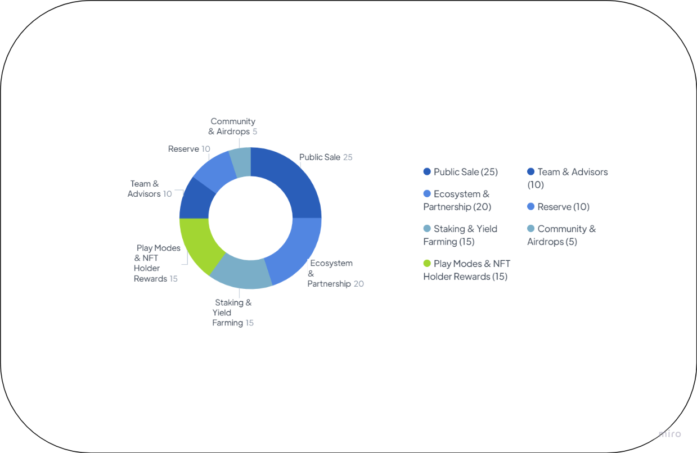

# التوزيع

<figure><figcaption></figcaption></figure>

تم تصميم توزيع رمز PLAYW لمشروع Play Wallet لإنشاء اقتصاد رمزي متوازن ومستدام وجذاب للمستثمرين والمستخدمين. تم تحديد إجمالي عدد رموز PLAYW بـ 100,000,000 (100 مليون)، وتم تخصيصها لفئات مختلفة كما يلي:

| الفئة                           | العدد       | الوصف                                                                                                                                                                                                                                                                 |
| ------------------------------- | ----------- | --------------------------------------------------------------------------------------------------------------------------------------------------------------------------------------------------------------------------------------------------------------------- |
| الفريق والمستشارين              | 10,000,000  | مخصصة للفريق والمستشارين، مع فترة استثمار تبلغ 18 شهرًا ومهلة 6 أشهر بعد TGE.                                                                                                                                                                                      |
| النظام البيئي والشراكة          | 20,000,000  | مخصصة لتطوير النظام البيئي والشراكات، وقد تشمل الشراكات الاستراتيجية، منح النظام البيئي، وبرامج التعدين. سيتم استخدام 25% كحد أقصى في السنة على هذا التخصيص. سيتم إطلاق جزء منها في TGE لزرع حوض السيولة.                                                  |
| تطوير الأعمال                   | 25,000,000  | 
مصممة لتطوير ونمو المشروع، وتشمل الفئات: <strong>Pre-Sale</strong> - 12%، 12 000 000  <strong>الجولة العامة</strong> - 8%، 8 000 000  <strong>IDO</strong> - 5%، 5,000,000
                                                                               |
| المجتمع والهبات الجوية          | 5,000,000   | مخصصة للمجتمع، بما في ذلك الهبات الجوية، وحوافز المجتمع، وأنشطة التسويق الأخرى. هذا التخصيص يشجع على مشاركة المستخدم ويحافظ على مجتمع مخلص ومشارك.                                                                                                                |
| الاحتياطي                       | 10,000,000  | محتفظ به لتلبية احتياجات المشروع المستقبلية والنمو المحتمل.                                                                                                                                                                                                        |
| المشاركة وزراعة العائد          | 15,000,000  | مخصصة لبرامج المشاركة وزراعة العائد، والتي تقدم حوافز للمستخدمين لمشاركة رموزهم والمشاركة في فرص زراعة العائد.                                                                                                                                                     |
| أوضاع اللعب ومكافآت حاملي NFT   | 15,000,000  | مخصصة لمكافأة المستخدمين الذين يشاركون في أوضاع اللعب وحاملي NFT، مما يضمن أن يستفيدوا من نجاح المشروع ويتلقون حصة عادلة من الأرباح التي تم إنشاؤها.                                                                                                              |


تم تصميم توزيع رمز PLAYW لدعم نمو وتطوير نظام Play Wallet البيئي، وتعزيز الشراكات الاستراتيجية، وتحفيز مشاركة المستخدم. من خلال تخصيص الرموز لفئات مختلفة، يهدف المشروع إلى إنشاء اقتصاد رمزي متوازن ومستدام يسمح للمستثمرين والمستخدمين بكسب المكافآت بأمان أثناء المساهمة في نجاح المشروع على المدى الطويل.

