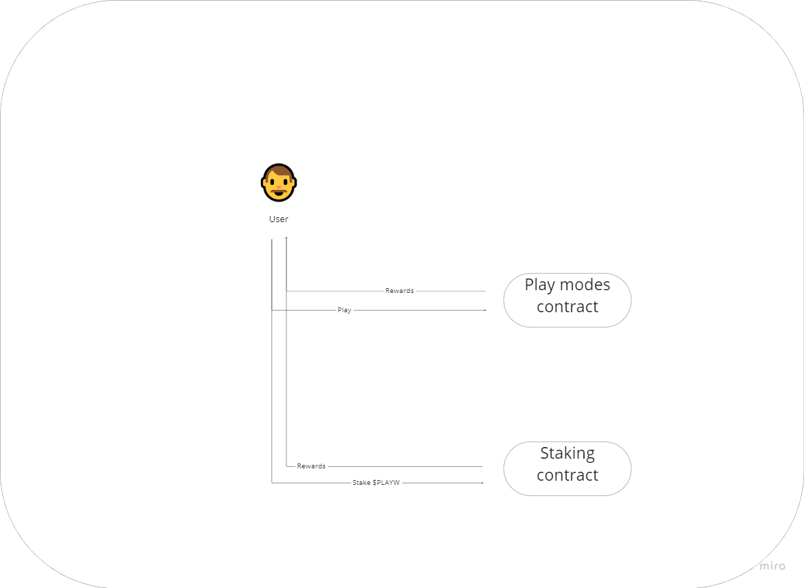
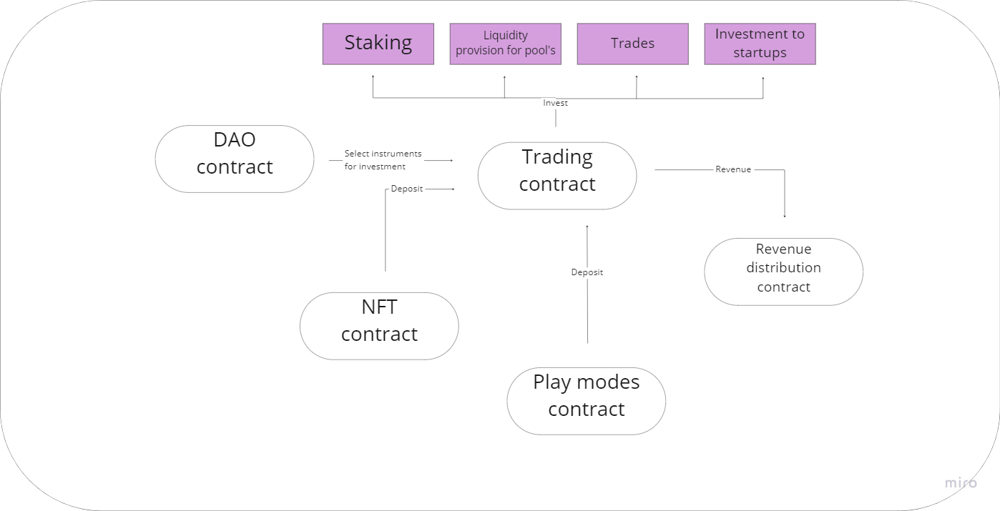
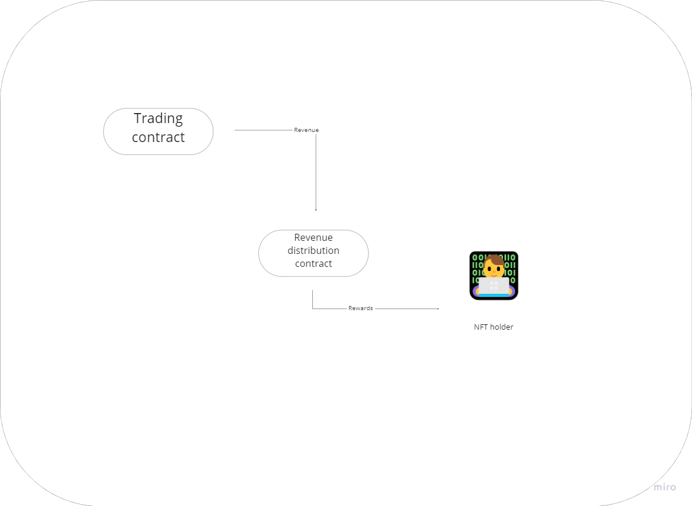

# الوصف التقني

<figure><figcaption></figcaption></figure>

تُنظم عقود Play Wallet الذكية في هيكل بسيط:

1. عقد NFT: يُصدر النقود الرقمية NFT لأولئك الذين يرغبون في الانضمام إلى نادي إدارة المشروع الحصري، مع التحقق أيضًا من حقوقهم في المشاركة في عمليات التصويت المشروع.
2. عقد DAO: يسمح لحاملي NFT بإدارة المشروع، اتخاذ قرارات بشأن تطويره المستقبلي، واختيار الأدوات الاستثمارية لأموال المشروع.
3. عقد التداول: يدير أصول الموقع ويشرف على عمليات الاستثمار.
4. عقد توزيع العائد: يوزع جميع أرباح الاستثمار بين حاملي NFT.
5. عقد $PLAYW: عقد الرمز المميز للمنصة.
6. عقد الرهان: يقدم الخيار لرهن الرمز المميز $PLAYW الداخلي.
7. عقد أوضاع اللعب: يحدد منطق أوضاع اللعب ويحول العائدات من الخسائر إلى عقد التداول لمزيد من الإدارة.

### حامل NFT

<figure><figcaption>
تفاعلات حامل NFT
</figcaption></figure>

يلعب حاملو NFT دورًا محوريًا في Play Wallet. كمستثمرين أساسيين، يحصلون على الوصول إلى الميزات الحصرية للمنصة بما يتجاوز أوضاع اللعب العامة والرهان. لدى حاملي NFT الفرصة الفريدة للمشاركة في تشكيل اتجاه تطوير المشروع، والتأثير على الوظائف المضافة، واتخاذ قرارات أخرى حاسمة تؤثر على نمو ونجاح المنصة. يضمن هذا التورط أن يتطور المشروع بطريقة تتوافق مع مصالح وتفضيلات أصحاب الرهان القيمين.

### المستخدم

<figure><figcaption>
تفاعلات المستخدم
</figcaption></figure>

المستخدم في Play Wallet هو أي شخص مهتم باستكشاف واستخدام ميزات المنصة. يحصل المستخدمون على الوصول إلى مجموعة متنوعة من أوضاع اللعب وخيارات الرهان، مما يقدم لهم العديد من الطرق للتفاعل مع المنصة وربما جني الجوائز. يضمن هذا النهج المتضمن أن يجد الأفراد ذوي المصالح والتفضيلات المتنوعة شيئًا ممتعًا ومفيدًا على المنصة.

### التداول

<figure><figcaption>
نهج التداول
</figcaption></figure>

يلعب عقد التداول دورًا حيويًا في تضخيم الأموال المستثمرة في المشروع. بإدارة عقد DAO، يدير استراتيجية التداول، مع تزويد الأموال من قبل عقدي NFT وأوضاع اللعب. ثم يتم توجيه جميع الأرباح المُحرزة إلى عقد توزيع العائد، الذي يضمن تخصيص العائدات بين حاملي NFT بطريقة عادلة. يربط هذا النهج المتكامل مكونات مختلفة من المنصة لتقديم تجربة تحقيق أرباح سلسة وفعالة لحاملي NFT.

### توزيع العائد

<figure><figcaption>
توزيع العائد
</figcaption></figure>

تم تصميم عملية توزيع الأرباح لتكون شفافة قصوى. يتم تخصيص الأرباح استنادًا إلى الكمية وندرة النقود الرقمية NFT التي تحملها، مما يضمن نظامًا عادلًا ومتساويًا يكافئ المشاركين النشطين والمستثمرين في المنصة.
