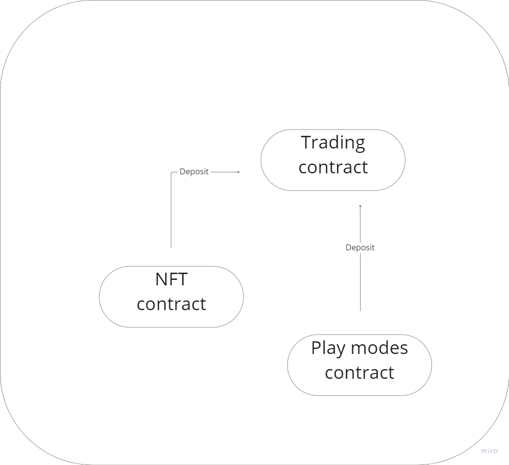

# عقد الودائع التجارية

<figure><figcaption>
مصدر الودائع
</figcaption></figure>

### NFT

80% من العائدات التي تم إنشاؤها من بيع رموز NFT تُخصص لعقد التداول، مما يؤسس رأس مال أولي قوي للاستثمارات اللاحقة ويمكن المنصة من النمو وتوليد أرباح لمشاركيها.

### أوضاع اللعب

50% من الأموال التي تم إنشاؤها من الخسائر في أوضاع اللعب يتم توجيهها أيضًا إلى عقد التداول، مما يزيد من رأس المال الاستثماري ويعزز قدرة المنصة على توليد أرباح لمشاركيها.

### الرسوم من شراء/بيع $PLAYW

25% من الرسوم التي تم إنشاؤها من شراء وبيع $PLAYW يتم توجيهها إلى عقد التداول، مما يساعد في زيادة الأموال المتاحة للاستثمارات ويولد عائدات إضافية للمشروع ومشاركيه.
