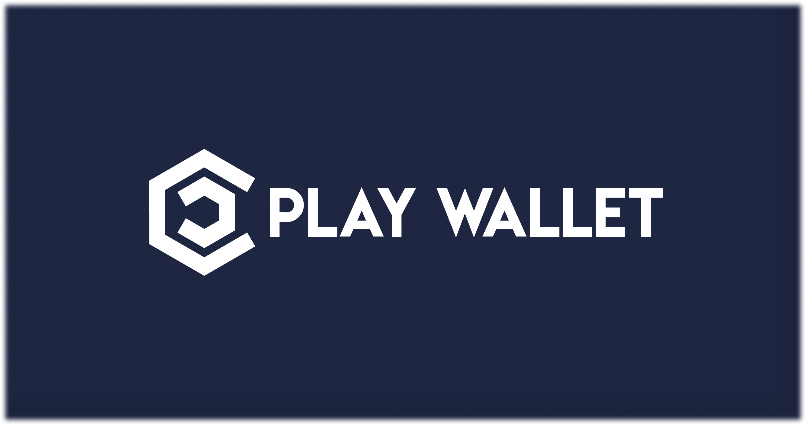

# Overview

<figure><figcaption></figcaption></figure>

### 介绍

Play Wallet 是一个完全基于链的协议，旨在根据您的喜好在加密市场中赋予您权力。通过参与，您可以获得对一个提供Play Wallet创新功能的一致性被动收入的精英投资俱乐部的专属访问。

许多对加密货币感兴趣的人经常不知所措，因为有很多可用的机制，例如NFT收藏、玩耍以赚、质押、**AI模型**等等。我们的使命是为新手简化入门流程，同时通过建立统一和公共平台确保对经验丰富的投资者长期有利的合作。

我们平台的投资关键是一个NFT代币，其有限的供应设定了参与者数量的专属上限。 NFT代币的销售收入被用于通过公共智能合约生成利润，确保完全自动化和透明性。我们平台的一个关键特点是所有收入都分配给NFT持有人，培养共同繁荣的感觉。


Play Wallet 专注于可持续性和增长。我们计划在所有受欢迎的L2网络上推出，包括 Arbitrum(首次推出网络)、zkSync、Polygon、Optimism、Fantom、Ton 等。首个网络的早期采纳者将享受后续网络的收益百分比，让他们体验到Smart Money，并奖励他们对Play Wallet的成功的承诺。


### Play Wallet 的不可思议

* 所有NFT销售的收入都将被用于为平台产生利润，然后完全分配给Play Wallet参与者。
* 生成利润的过程完全透明，并受到智能合约的管理，确保信任和责任。
* Play Wallet 通过提供各种盈利机制来迎合各种偏好。混合并匹配它们以创建自定义策略并获得丰厚的回报。
* 随着项目的发展，其未来方向将完全由Play Wallet DAO决定。您的投票对于社区和Play Wallet的成功都具有重要价值，强调了积极参与和合作的重要性。
* **AI驱动的交易洞察**：[Marker Masters](play-to-earn/play-modes/market-masters/) 模式为$PLAYW 代币股东提供宝贵的交易洞察，利用我们的AI交易模型。这个模型从各种市场数据、推特上的加密货币影响者帖子、鲸鱼钱包活动和在Marker Masters模式中进行的用户预测中学习。随着模型的改进，它将提供越来越准确和有利可图的见解，使所有$PLAYW代币持有者受益。

### 未来项目方向

Play Wallet 是一个多功能平台，其愿景是成为数字资产管理和游戏的首选解决方案。凭借一支技术娴熟的开发团队，Play Wallet 旨在覆盖广泛的市场并提供一整套功能。在本章中，我们将探讨项目的多种方向及其为用户所持有的潜力。

#### 人工智能学习

Play Wallet站在创新的最前沿，结合了区块链技术、挖矿和人工智能(AI)学习的力量。在本章中，我们将探讨Play Wallet生态系统内去中心化AI学习的激动人心的概念。通过利用用户的集体资源和AI的潜力，Play Wallet彻底改变了AI模型的培训和奖励方式。

* **去中心化学习**：Play Wallet推出了一个去中心化的学习平台，AI所有者可以利用网络参与者的集体计算能力更高效、更经济地培训他们的模型。通过去中心化学习过程，该平台促进了合作和资源共享，使AI所有者能够获得更快速、更准确的结果。
* **为学习报价质押**：为了参与AI学习过程，用户可以在平台上质押他们的资金。质押的资金金额决定了他们使用AI学习资源的报价。这种创新方法允许用户为学习生态系统做出贡献，同时根据他们的贡献获得奖励。
* **成本效益的AI培训**：传统的AI培训可能需要大量的资源和成本。但是，通过Play Wallet的去中心化学习模型，AI所有者可以以一小部分的成本培训他们的模型。通过利用社区共享的集体计算能力和资源，AI所有者可以大大减少他们的费用，同时获得高质量的AI模型。
* **资源分享的激励**：为去中心化学习网络贡献计算资源的用户将因参与而获得奖励。通过共享他们的计算能力，用户不仅支持AI学习过程，而且以代币或其他奖励的形式获得激励。这种激励模型鼓励在Play Wallet生态系统内积极参与和资源共享。
* **AI技术的进步**：通过去中心化学习平台，Play Wallet旨在促进AI技术的进步。AI所有者和网络参与者之间的合作将推动AI技术的发展，为未来创造新的机会和应用。

区块链技术、挖矿和AI学习在Play Wallet中的集成为去中心化AI培训开启了新的视野。通过结合集体资源的力量和激励参与，Play Wallet授权用户参与AI学习过程并分享奖励。通过这种创新方法，Play Wallet推动AI技术的增长并促进其在各种行业中的广泛采纳。

#### 房地产代币化

在这一章中，我们深入探讨Play Wallet生态系统内的房地产代币化的令人兴奋的世界。房地产代币化代表了一种突破性的创新，改变了房产的所有权、交易和投资方式。Play Wallet旨在解锁代币化房地产资产的巨大潜力，使其对投资者更加易于访问、流动和包容。

* **代币化的力量：** 房地产代币化涉及将实物房地产资产转化为可以在区块链上安全存储和转移的数字代币。此过程使得可以分散所有权，将房产划分为可以轻松购买、出售和交易的较小单位。通过代币化房地产，Play Wallet为物业所有者和投资者带来了众多好处。
* **增加的可访问性：** 传统的房地产投资通常需要大量的资本，只限于少数人。通过房地产代币化，Play Wallet使物业所有权民主化，允许各种规模的投资者参与。分散的所有权使得可以拥有物业的一部分，使个人能够多样化他们的投资组合并进入房地产市场。
* **增强的流动性：** 房地产代币化的一个主要优势是它为市场带来的增加的流动性。与可能需要花费时间并且繁琐的传统房地产交易不同，代币化的物业可以在基于区块链的平台上轻松买卖。这种流动性为投资者提供了更大的灵活性和更高效地退出其投资的能力。
* **透明度和安全性：** 通过利用区块链技术，Play Wallet确保在整个房地产代币化过程中的透明度和安全性。物业所有权记录、交易历史和投资详情都在区块链上不可变地记录，减少了欺诈并增强了参与者之间的信任。智能合约管理物业代币的转移，自动化和简化交易过程。
* **分散所有权的好处：** 分散所有权允许投资者通过购买不同物业的代币来多样化他们的房地产持有。这种多样化分散了风险，并使个人能够投资于一系列的房地产资产，如住宅、商业或甚至国际物业。Play Wallet为投资者提供了一个用户友好的平台，供他们探索和选择与其投资目标一致的代币化物业。
* **被动收入的潜力：** 通过Play Wallet持有房地产代币的投资者有可能获得被动收入。由底层物业产生的租金收益或利润可以按比例分配给代币持有者。这种收入分配机制允许投资者参与房地产市场，可能在没有物业管理职责的情况下获得回报。

房地产代币化即将改变房产的所有权、交易和投资方式。Play Wallet进入房地产代币化为投资者打开了一个机会的世界，提供了增加的可访问性、流动性、透明度和被动收入的潜力。通过采纳这种创新方法，Play Wallet旨在重塑房地产格局，使物业所有权对所有人都成为一个无缝和包容的体验。

#### 借款

在这一章中，我们探讨Play Wallet提供的借款功能，赋予用户快速便捷地访问资金的能力。在Play Wallet生态系统内借款为个人提供了满足他们的财务需求的灵活性，无论是用于个人开支、商业创业还是投资机会。

* 即时流动性的访问：Play Wallet的借款功能允许用户通过使用其现有的数字资产作为抵押来获得即时流动性。这消除了通常与传统借款方法相关的冗长审批过程或信用检查的需要。用户可以迅速、方便地访问资金，使他们能够抓住时效性的机会或解决紧急的财务需求。
* 抵押借款：Play Wallet的借款基于抵押原则。用户承诺他们的数字资产，如加密货币或代币化资产，作为抵押来确保借来的资金。抵押品的价值决定了借款能力，为借款提供了一个公平、透明的机制。通过使用抵押，Play Wallet减轻了风险并确保了放款人资金的安全。
* 灵活的贷款条款：Play Wallet提供了为满足用户独特需求而量身定制的灵活贷款条款。借款人可以自由选择与他们的财务目标和能力相一致的贷款金额、还款期限和利率。该平台为满足多样化借款需求提供了一系列的选项，确保了个性化和以用户为中心的借款体验。
* 有竞争力的利率：Play Wallet努力为借来的资金提供有竞争力的利率，使借款对用户来说既经济又具有成本效益。利率是根据市场条件确定的，确保了一个公平和透明的贷款环境。通过提供竞争性的利率，Play Wallet旨在支持用户在他们的财务努力，并帮助他们实现他们的目标，而不会产生过多的费用。
* 无缝的借款过程：Play Wallet内的借款过程旨在无缝和用户友好。用户可以方便地启动贷款请求，选择他们所需的贷款条款，并通过用户友好的界面监控他们的借款活动。该平台使用智能合约来自动化借贷过程，确保贷款管理的效率、透明度和准确性。
* 扩展的金融机会：通过Play Wallet借款为用户开启了丰富的金融机会。无论是为新的商业创业提供资金、抓住投资机会还是管理个人开支，借来的资金都提供了必要的财务灵活性。通过访问即时流动性，用户可以利用时效性的情况并做出明智的财务决策。

Play Wallet提供的借款功能使用户具有财务灵活性和即时访问资金的权力。通过抵押他们的数字资产，个人可以解锁流动性，抓住机会并高效地解决他们的财务需求。有竞争力的利率、灵活的贷款条款和无缝的借款过程，Play Wallet使用户可以轻松便捷地导航借款世界，扩大他们的财务视野并实现他们的目标。
