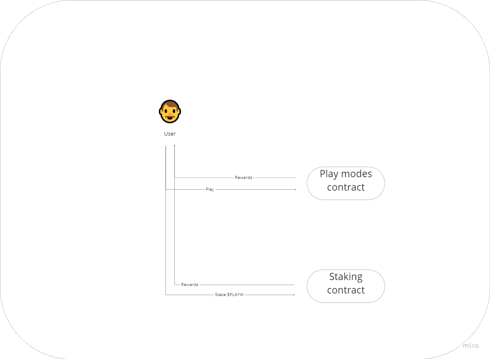
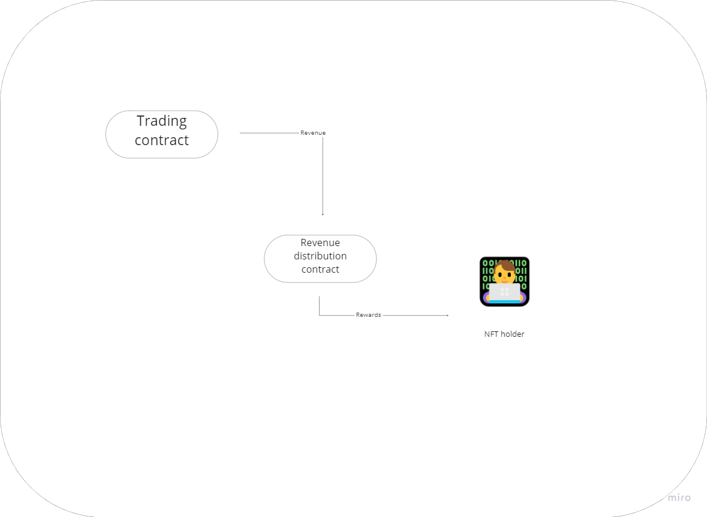

---
描述：合同描述
---

# 技术描述

<figure><figcaption></figcaption></figure>

Play Wallet的智能合同组织在一个简单明了的结构中：

1. NFT 合同：为那些希望加入独家项目管理俱乐部的人铸造NFT，同时验证他们参与项目投票操作的权利。
2. DAO 合同：允许NFT持有者管理项目，决定其未来的发展，以及为项目资金选择投资工具。
3. 交易合同：管理网站资产并监督投资操作。
4. 收益分配合同：将所有投资利润分配给NFT持有者。
5. $PLAYW 合同：平台的本地代币合同。
6. 质押合同：提供质押内部$PLAYW代币的选项。
7. Play模式合同：定义游戏模式的逻辑，并将损失的收益转移到交易合同以供进一步管理。

### NFT持有者

<figure><figcaption>
NFT持有者的互动
</figcaption></figure>

NFT持有者在Play Wallet中起到关键作用。作为主要的投资者，他们可以访问平台上的独家功能，超出公共玩家模式和质押。NFT持有者有独特的机会参与项目的发展方向，影响增加的功能，并作出对平台的增长和成功产生影响的其他关键决策。这种参与确保项目的发展与其有价值的利益相关者的利益和偏好相一致。

### 用户

<figure><figcaption>
用户互动
</figcaption></figure>

Play Wallet的用户是任何对探索和利用平台的功能感兴趣的人。用户可以访问各种各样的玩家模式和质押选项，为他们提供多种与平台互动并可能获得奖励的方式。这种包容性的方法确保各种兴趣和偏好的人都可以在平台上找到一些有趣和有益的东西。

### 交易

<figure><figcaption>
交易方法
</figcaption></figure>

交易合同在放大项目中投资的资金方面发挥了关键作用。由DAO合同管理，它管理交易策略，资金由NFT和Play模式合同供应。然后将所有生成的利润指向收入分配合同，确保NFT持有者之间公平分配收益。这种综合方法有效地链接了平台的各个组件，为NFT持有者提供了一个无缝且高效的盈利体验。

### 收益分配

<figure><figcaption>
收益分配
</figcaption></figure>

利润分配过程旨在实现最大透明度。根据您持有的NFT的数量和稀有性分配利润，确保一个公平和公正的系统，奖励平台上的活跃和投资参与者。
