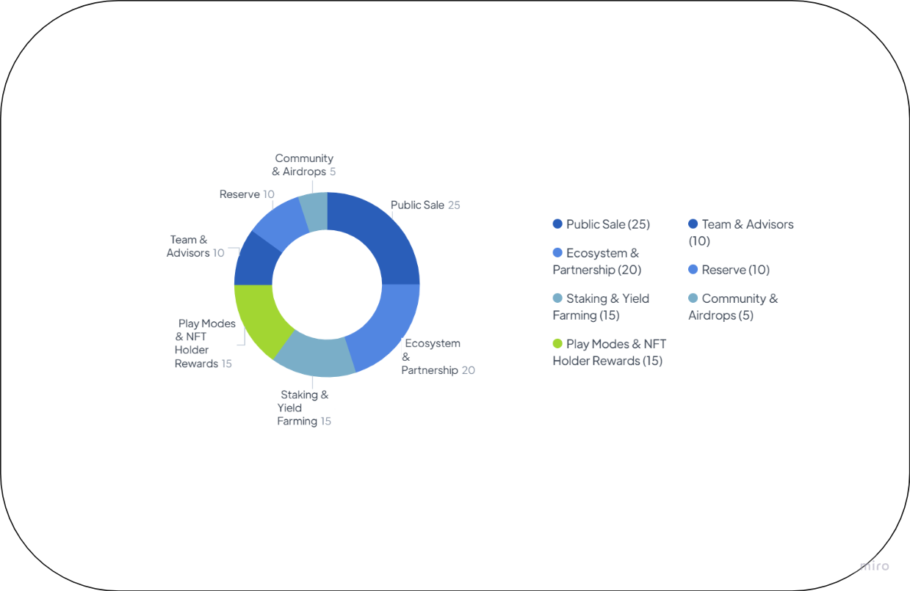

# Distribution

<figure><figcaption></figcaption></figure>

The distribution of PLAYW token for the Play Wallet project is designed to create a balanced, sustainable, and attractive token economy for investors and users. The total supply of PLAYW tokens is set at 100,000,000 (100 million), and they are allocated to various categories as follows:

| Categorie                       | Amount     | Description                                                                                                                                                                                                                                                         |
| ------------------------------- | ---------- | ------------------------------------------------------------------------------------------------------------------------------------------------------------------------------------------------------------------------------------------------------------------- |
| Team & Advisors                 | 10,000,000 | Reserved for the team and advisors, with a vesting period of 18 months and a 6 month cliff after TGE.                                                                                                                                                               |
| Ecosystem & Partnership         | 20,000,000 | Allocated for ecosystem and partnership development, which may include strategic partnerships, ecosystem grants, and liquidity mining programs. 25% maximum per year will be used on this allocation. A portion will be released at TGE to seed the liquidity pool. |
| Business Development            | 25,000,000 | 
Designed for the development and growth of the project, includes the categories: <strong>Pre-Sale</strong> - 12%, 12 000 000  <strong>Public round</strong> - 8%, 8 000 000  <strong>IDO</strong> - 5%, 5,000,000
                                      |
| Community & Airdrops            | 5,000,000  | Designated for the community, including airdrops, community incentives, and other marketing activities. This allocation encourages user participation and fosters a loyal and engaged community.                                                                    |
| Reserve                         | 10,000,000 | Held in reserve to cater to the project's future needs and potential growth.                                                                                                                                                                                        |
| Staking & Yield Farming         | 15,000,000 | Dedicated to staking and yield farming programs, which provide incentives for users to stake their tokens and participate in yield farming opportunities.                                                                                                           |
| Play Modes & NFT Holder Rewards | 15,000,000 | Allocated to reward users participating in Play modes and NFT holders, ensuring they benefit from the project's success and receive a fair share of the generated profits.                                                                                          |


The PLAYW token distribution is designed to support the growth and development of the Play Wallet ecosystem, foster strategic partnerships, and incentivize user participation. By allocating tokens to different categories, the project aims to create a balanced and sustainable token economy that allows investors and users to safely earn rewards while contributing to the project's long-term success.

