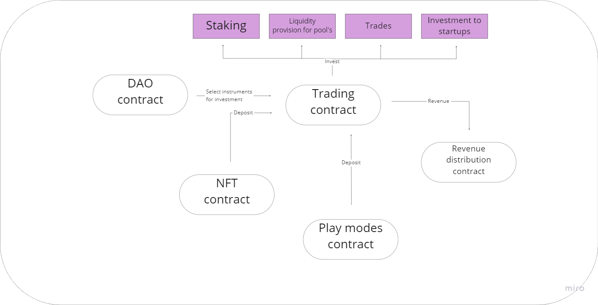

# Technical Description

<figure><figcaption></figcaption></figure>

Play Wallet's smart contracts are organized in a straightforward structure:

1. NFT Contract: Mints NFTs for those wishing to join an exclusive project management club, while also verifying their rights to participate in project voting operations.
2. DAO Contract: Allows NFT holders to govern the project, make decisions on its future development, and choose the investment instruments for project funds.
3. Trading Contract: Manages site assets and oversees investment operations.
4. Revenue Distribution Contract: Distributes all investment profits among NFT holders.
5. $PLAYW Contract: The contract for the platform's native token.
6. Staking Contract: Offers the option to stake the internal $PLAYW token.
7. Play Modes Contract: Defines the logic of game modes and transfers the proceeds from losses to the trading contract for further management.

### NFT Holder

<figure><figcaption>
NFT Holder Interactions
</figcaption></figure>

NFT holders play a pivotal role in Play Wallet. As primary investors, they gain access to the platform's exclusive features beyond the public play modes and staking. NFT holders have the unique opportunity to participate in shaping the project's development direction, influencing added functionality, and making other crucial decisions that impact the platform's growth and success. This involvement ensures that the project evolves in a way that aligns with the interests and preferences of its valued stakeholders.

### User

<figure><figcaption>
User Interactions
</figcaption></figure>

A user of Play Wallet is anyone interested in exploring and utilizing the platform's features. Users gain access to a diverse range of play modes and staking options, offering them a multitude of ways to engage with the platform and potentially reap rewards. This inclusive approach ensures that individuals with varying interests and preferences can find something enjoyable and beneficial on the platform.

### Trading

<figure><figcaption>
Trading Approach
</figcaption></figure>

The trading contract plays a crucial role in amplifying the funds invested in the project. Governed by the DAO contract, it manages the trading strategy, with funds being supplied by both the NFT and Play modes contracts. All profits generated are then directed to the Revenue distribution contract, which ensures the fair allocation of proceeds among NFT holders. This integrated approach effectively links various components of the platform to deliver a seamless and efficient profit-generating experience for NFT holders.

### Revenue distribution

<figure><figcaption>
Revenue Distribution
</figcaption></figure>

The profit distribution process is designed for maximum transparency. Profits are allocated based on the quantity and rarity of the NFTs you hold, ensuring a fair and equitable system that rewards active and invested participants in the platform.

