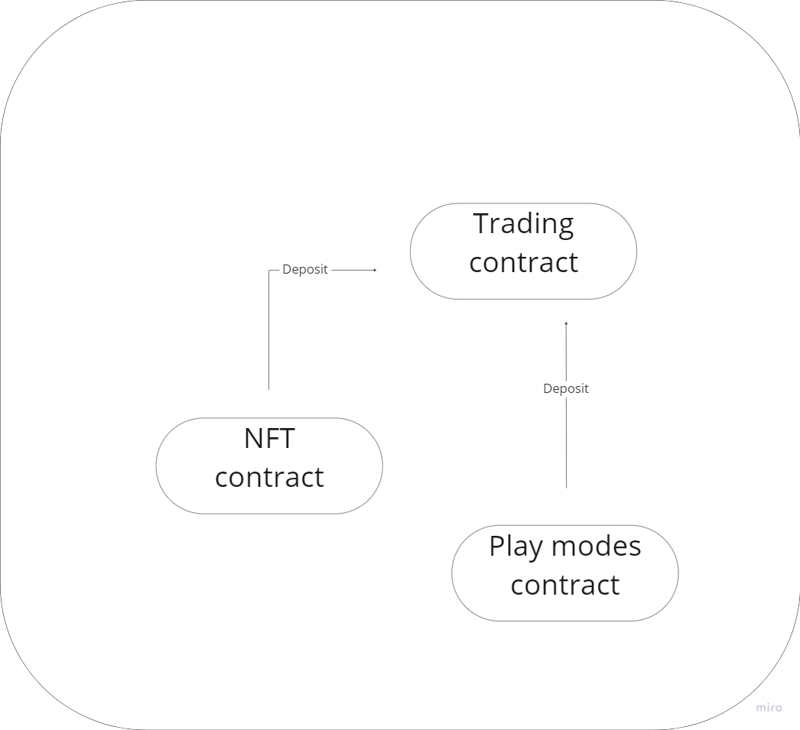

# Trading contract deposits

<figure><figcaption>
Source of Deposits
</figcaption></figure>

### NFT

80% of the proceeds generated from the sale of NFT tokens are allocated to the Trading contract, establishing a solid initial capital for subsequent investments and enabling the platform to grow and generate profits for its participants.

### Play modes

50% of funds generated from losses in Play modes are also directed to the Trading contract, further bolstering the investment capital and enhancing the platform's ability to generate profits for its participants.

### Fees from buy/sell $PLAYW

25% of the fees generated from buying and selling $PLAYW are directed to the Trading contract, which helps to increase the funds available for investments and generates additional returns for the project and its participants.

